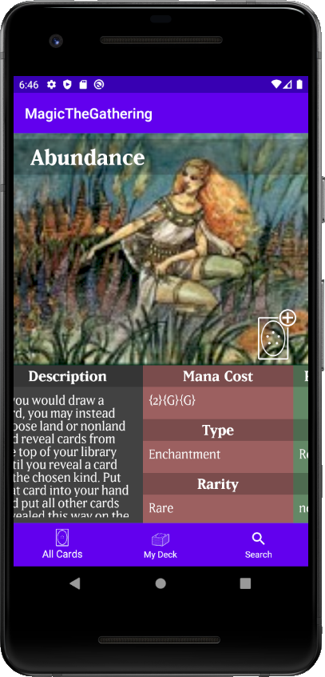

# MagicTheGathering APP
Es una aplicacion que permite obtener información de las diferentes cartas del TCG "Magic The Gathering"

## Consumo de API
Consume datos desde la API
```bash
https://magicthegathering.io
```

## Implementaciones
- [Material Design](https://material.io/develop/android/docs/getting-started) - Utilidades de diseño
- [Retrofit](https://square.github.io/retrofit/) - Consumo de API
- [Picasso](https://square.github.io/picasso/) - Importar imágenes
- [Lifecycle](https://developer.android.com/jetpack/androidx/releases/lifecycle) - Respuesta segun ciclo de vida de los componentes
- [Room](https://developer.android.com/jetpack/androidx/releases/room) - Acceso a base de datos
- [Firebase](https://firebase.google.com/docs/android/setup)

## Capturas de pantalla





## Funcionamiento
- La aplicación inicia en la pantalla de Login, donde el usuario ingresa sus datos o se registra con datos nuevos.
- Se carga en una lista las cartas descargadas a la base de datos. Dado que la API funciona con paginación, se cargan 100 elementos y se irán cargando 100 más por cada pagina cargada de la API.
- Al realizar click en una carta de la lista, esta muestra su información detallada. Para acceder a la imagen de la carta en pantalla completa, debe hacer click en el retrato de la carta.

## POR DESARROLLAR
- Habilitar botones de la barra de navegación inferior.
- Habilitar guardado de cartas en una nueva lista denominada "My Deck" ("Mi Mazo").
- Habilitar paginación por numero de pagina seleccionada.
- Habilitar la búsqueda de carta por nombre.